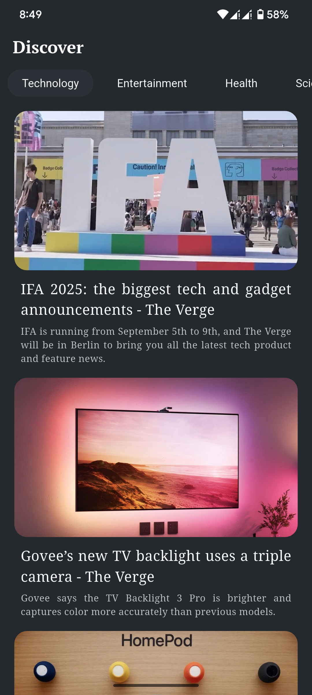

A mobile application built with Flutter that fetches the latest news articles directly from the internet using an API. The app displays real-time headlines and detailed articles with a clean and responsive user interface. Users can browse different categories, read full stories, and stay updated with current events. This project highlights skills in API integration, state management, and building user-friendly UI components.

